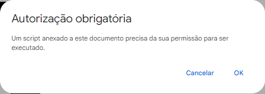
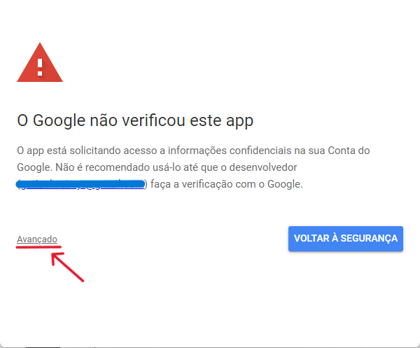
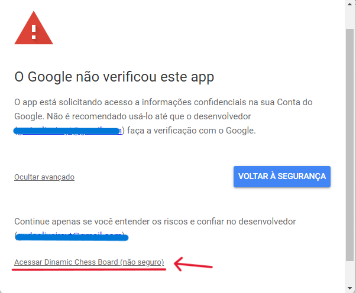
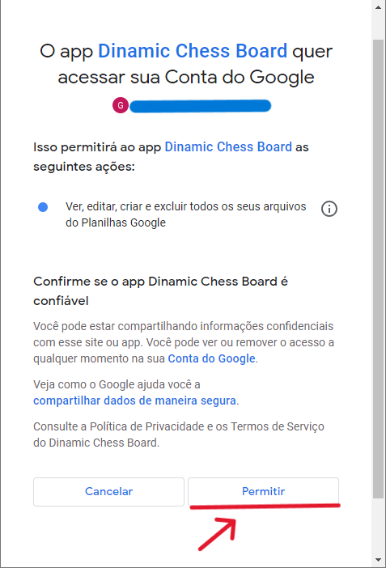

# Google Apps Script Permissions
This is a simple tutorial to teach how to give permissions to your scripts on Google Apps Scripts to run

## Why i need to do this?

When you run Google Apps Script, especially when it interacts with external services or requires access to certain data, you often need to grant permissions. This is a security measure designed to ensure that you, as the script owner, are aware of and approve the actions the script will perform. Here are the common reasons why you might need to give permissions for your Google Apps Script to run:

1. **Access to External Services:**
   - Permission to interact with external services like Gmail, Google Drive, etc.

2. **Authorization for Sensitive Scopes:**
   - Approval for actions that require specific authorization scopes.

3. **User Consent:**
   - User permission to access their data (e.g., Google Sheets, Calendar).

4. **API Access:**
   - Configuration for advanced Google APIs in the Google Cloud Console.

5. **Security Review for Published Add-ons:**
   - Required for published add-ons to meet security and privacy standards.

6. **Permissions for Triggers:**
   - Additional permissions for scripts running automatically at intervals.

That's why you always need to be cautious when granting permissions to scripts, especially those developed by third parties. Only grant access to scripts from sources you trust, and review the requested permissions to understand what actions the script will perform.

## How to grant access?

The first time you run any script in any project for the first time, it will show the permission pop-up, click on **"OK"** here
  

Then, it will ask you to log in into the account you want to give the permissions

After that it will show you this message. Here it says that Google hasn't verified this app, that's because the script is not made by Google, but by a third-party author. Here, click on the **"Advanced"** option

Then, just click on "Access _your_project_here_"

After that, it will show you all the permissions you need to give the project to it run properly, here is just click on **"Allow"**

# That's it, now you can run all the scripts properly, enjoy!

